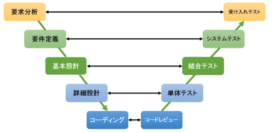
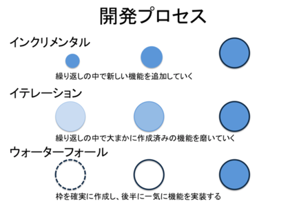

## 2. ソフトウェアライフサイクルを通じてのテスト

### 2.1 ソフトウェア開発モデル

- V字モデル
    - コンポーネントテスト、統合テスト、システムテスト、受け入れテスト

- イテレーティブーインクリメンタル開発
    - プロトタイプ、RAD、RUP、アジャイル開発
    それぞれのイテレーションで複数テストレベル実施。回帰テスト。
    

- ライフサイクルモデルの中のテスト

    良いテストとは
    - 各開発活動に応じてテスト活動。また、開発中にテスト分析、設計を行う
    - テストレベルに応じて目的

### 2.2 テストレベル

- コンポーネントテスト
    - ユニットテストのこと
    - 機能、リソース系、ロバストネス、構造テスト？
    - バグ見つけたらすぐ修正
    - テスト駆動開発

- 統合テスト
    - モジュール間の相互作用、そのインターフェースのテスト
    - コンポーネントテスト統合テスト：モジュール間の結合
    - システム統合テスト：他システム、ハード- ソフト

- システムテスト
    - 最終運用環境で行うべき
    - 仕様書渡して、独立したチームがやることが多い。これがKSW？
    
- 受け入れテスト
    - システムを使うユーザが実施
    - 欠陥摘出ではなく、ちゃんと動いているかを確認するもの

### 2.3 テストタイプ

- 機能テスト
    - 機能をテスト
    - すべてのレベルで実施
    - 仕様ベース（ブラックボックス）
 
- 非機能テスト
    - どのように動作するのか
    - システムの特性を測る。基本ブラックボックス

- 構造テスト
    - ホワイトボックス
    - 仕様ベースの技法のあとに行う？？
    - カバレッジを100%に。
    - これよくわからん

- 回帰テスト
    - 変更のせいでよけいなバグが増えてないか、一応今までのテストもやりなおすこと

2.4 保守テスト

- バージョンアップ、修正パッチ後に回すテスト
- 影響度分析（変更によって既存システムが受ける影響をチェックする）