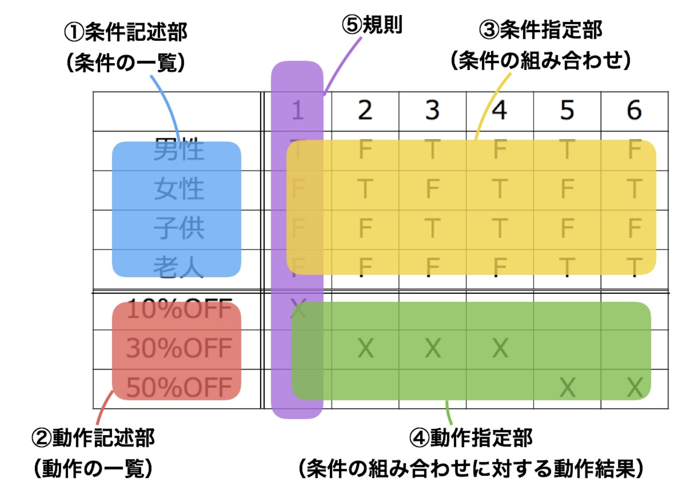
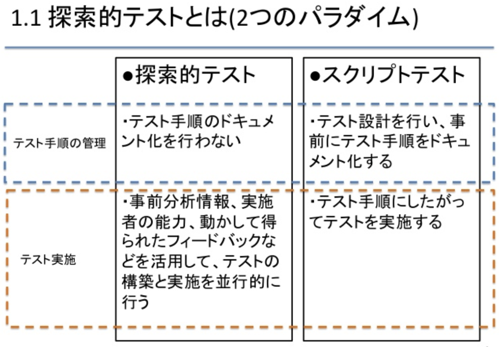

## 4. テスト設計技法

### 4.1 テスト開発プロセス 

- 非形式的なものから形式的なものまで
    - 開発プロセスの成熟度、時間的な余裕によって左右

- トレーサビリティを確立すると、要件を変更したときに楽

テストケース
- 入力データ群
- 事前条件
- 期待結果
    - ちゃんと実行前に定義する
- 事後条件

### 4.2 テスト設計技法のカテゴリ

テスト設計技法の目的  
-> テスト条件、テストケース、テストデータを決定すること

- ブラックボックステスト (仕様ベース)
    - 機能テスト、非機能テストがある
    - モデルを使用し、体系的にテストケースを導く
    
- ホワイトボックステスト （構造ベース)
    - コードや設計情報を元にテストケースを導く
    - カバレッジを上げるためのテストケースを導く

- 経験ベースの技法
    - 担当者の知識や経験

### 4.3 仕様ベース / ブラックボックステスト

####  同値分割法

なんとなく同じような処理をグループ化して、
代表的な場合をテストする
1.  同値クラスを作る
2. 同値クラスを分類する
3. 代表値を決定する
4. テスト条件を決定する
5. テスト条件を見直す

カバレッジ目標を達成する場合に使用??

#### 境界値分析

境界値分析

#### デシジョンテーブルテスト

システムの内部設計をドキュメント化する場合の有効

各列は、条件の組み合わせを定義するビジネスルールと、ルールに対応した行動

#### 状態遷移テスト

状態遷移図を書いて埋めていく

#### ユースケーステスト

システムのメインストリームとなるプロセスの流れを決めて、それに沿ってテストケースを設定

### 4.4 構造ベース / ホワイトボックステスト

レベルによってどこの構造に着目するか変わる
- コンポーネント : statement, dicision, branch, path  
- 統合レベル : コールツリー  
- システムレベル : メニュー構造、ビジネスプロセス、web page

#### ステートメントとカバレッジ

ステートメントカバレッジ = (テストケースで網羅したステートメント) / （実行可能なステートメント数）

#### デシジョンテストとカバレッジ

ブランチテストとも  
デシジョンカバレッジ = (テストケースで網羅した判定数) / （実行可能な判定数） 
ステートメントよりも厳しい基準

#### その他

条件カバレッジ、複合条件カバレッジ

### 4.5. 経験ベースのテスト技法

経験によるため、ばらつき  
- フォールト攻撃
    -   発生しうる欠陥をリストアップ -> それを攻撃するテストケース

- 探索的テスト

